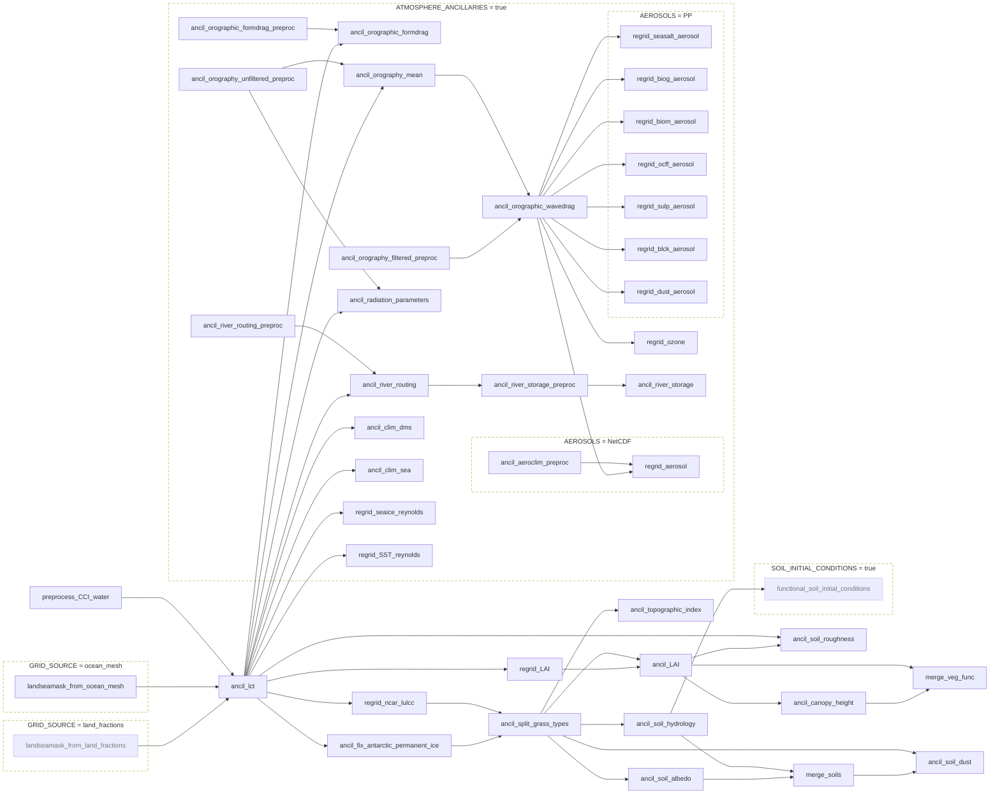

# Apps

The CCI Ancillary Suite is built from a set of Rose apps, one per task in the workflow. Each app has its own page in this section, describing what it does and the inputs, outputs and parameters it takes. The pages are the same as the `README.md` files in each app's directory in the repository.

The graph below shows how the apps depend on each other. Click an app to go to its page. Apps inside a dashed box are only included in the workflow when the stated option in `rose-suite.conf` takes that value; all other apps are always run.

